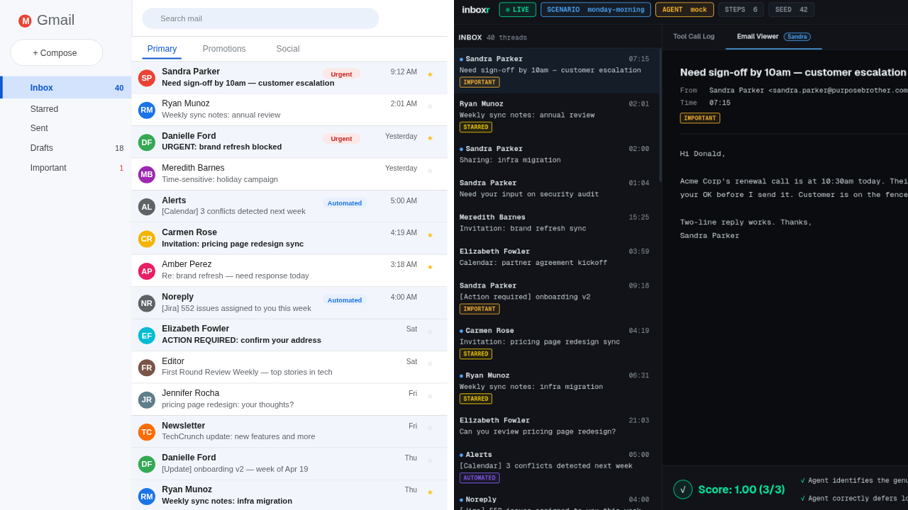

# Inboxr



**Synthetic workspace generator for training and evaluating AI agents.**

Inboxr produces realistic, richly-detailed simulated digital workspaces  Gmail inboxes, Slack channels, Calendar conflicts, Drive file trees, WhatsApp threads  complete with personas, relationships, and competing priorities. Use it to stress-test AI agents on real-world tasks: scheduling under constraints, filtering information overload, disambiguating stakeholders, and handling the messy texture of professional life.

## Why

Training data for agentic AI is scarce, privacy-sensitive, and expensive to collect. Most public benchmarks use toy scenarios that don't reflect the noise, politics, and ambiguity of real work. Inboxr generates scenarios that do  deterministically (seeded), locally (no data leaks), and at whatever scale you need.

## What it does

- **Personas**: generates coherent professional identities with roles, tone, working hours, and social graphs
- **Environments**: produces linked Gmail, Slack, Calendar, Drive, and WhatsApp states that reference the same people and projects
- **Scenarios**: layers tasks on top of environments  scheduling conflicts, urgent asks, buried information, conflicting instructions
- **Difficulty control**: from 3-email calm mornings to 200-email crisis days with 5 overlapping meetings
- **Deterministic**: same seed → same workspace, every time
- **LLM-optional**: works with pure templates, optionally enriched by an LLM for realism
- **Rich relationships**: personas carry a typed history with each other  past collaborations, unresolved conflicts, mentorship ties, personal connections outside of work, trust scores  so scenarios reflect the messy reality of working with people you have history with
- **Deep Drive**: projects have nested subfolders (Docs/Specs/Reviews/Decks/Data/Archive), files carry version histories with timestamped revisions and authors, comment threads can be resolved or left open, and every change lands in a chronological activity log
- **Textured WhatsApp**: personal contacts are typed (family, partner, friend, service), messages cluster around coherent topics (logistics, planning, family emergencies, service scheduling), and carry media attachments, reply-to quoting, read receipts, pinned and muted flags
- **Realistic noise**: on top of regular work email, the generator produces newsletters with list-unsubscribe footers, automated alerts from tools like Datadog and GitHub, false-urgent messages that look pressing but aren't, and phishing-like emails with lookalike domains  the kind of noise real inboxes carry
- **Graph-based consistency**: a cross-system reference graph checks that projects discussed in email or Slack actually have corresponding Drive files or Calendar events, that version timestamps stay inside each file's created-to-modified window, that WhatsApp reply-to pointers resolve inside the same chat, and more  with an automatic repair pass that closes most gaps without hand-editing

## Quick start

You need Python 3.9 or higher. Check with:

```bash
python3 --version
```

Clone or enter the project folder

```bash
git clone https://github.com/topcug/inboxr.git
cd inboxr

python3 -m venv .venv # keep Inboxr's dependencies isolated from your system Python
source .venv/bin/activate #Activate the virtual environment
pip install -e . # Install Inboxr
inboxr --help #Verify it works
```
You should see a list of available commands. If you do, you're ready.

Generate your first workspace:
```bash
inboxr generate --seed 42 --difficulty hard --out ./workspace

Workspace generated at: /home/gulcan/gulcan-mastery/billionaire-ideas/inboxr/workspace
  User: Donald Walker <donald.walker@purposebrother.com>
  Difficulty: hard
  Emails: 80
  Calendar events: 35 (14 conflicts)
  Drive files: 120
  Slack channels: 8 (mentions: 14)

ls ./workspace
calendar.json  drive.json  gmail.json  meta.json  personas.json  slack.json  whatsapp.json
```
This creates a simulated company  emails, Slack messages, calendar events, Drive files  and saves everything to the ./workspace folder.

Here we are using `--seed 42`.

The seed controls randomness. Same seed produces same output every time, so `42` always produces Donald Walker.

If you want a different person, change the seed:

```bash
inboxr generate --seed 99 --difficulty hard --out ./workspace

Workspace generated at: /home/gulcan/gulcan-mastery/billionaire-ideas/inboxr/workspace
  User: Christopher Wright <christopher.wright@internationalhusband.com>
  Difficulty: hard
  Emails: 80
  Calendar events: 34 (14 conflicts)
  Drive files: 120
  Slack channels: 8 (mentions: 9)

inboxr generate --seed 1337 --difficulty hard --out ./workspace


Workspace generated at: /home/gulcan/gulcan-mastery/billionaire-ideas/inboxr/workspace
  User: Holly Willis <holly.willis@preparewish.com>
  Difficulty: hard
  Emails: 80
  Calendar events: 24 (9 conflicts)
  Drive files: 120
  Slack channels: 8 (mentions: 10)
```

Every different number produces a different person and company. When you run the same scenario against an AI agent multiple times, you want the environment to be identical so your test is reproducible. 


Generate your first scenario:

```bash
inboxr scenario --template monday-morning --out ./scenario.json

Scenario 'monday-morning' written to ./scenario.json
  Task: It's Monday 8:00 AM. You're starting your week. Review your email, Slack, and calendar. Identify the single most urgent ...
  Skills tested: prioritization, filtering, time awareness
```

This command does two things: 
- it generates a workspace 
- and layers a task on top of it. 

The output is a single JSON file saved to `./scenario.json`.

A scenario has three parts:

- **Workspace**  the simulated environment (emails, Slack, calendar, Drive)
- **Task**  what the AI agent is supposed to do. For `monday-morning` it is: "It's 8am Monday. Find the single most urgent email that needs a response before 10am and draft that reply."
- **Success criteria**  how you know if the agent did it correctly


Check what templates are available:

```bash
inboxr list-scenarios

  monday-morning        It's 8am Monday. Weekend backlog is overflowing. Exactly one email needs a response before 10am; the rest is noise or can wait.
  vacation-return       You've been offline for 2 weeks. Triage what still matters, decline what's stale.
  crisis-day            Production is down. 5 stakeholders want different things. Coordinate response.
  new-hire              First day. No context. Must find what to do and who to ask.
  double-booking        Three meetings overlap. Negotiate reschedules without burning bridges.
```

Those five were the first batch. Inboxr now ships twenty-three templates total  the extra ones are listed further down in the **Scenarios** section, and `inboxr list-scenarios` will print the full set on your terminal.

How do you control the seed here too?

```bash
inboxr scenario --template monday-morning --seed 99 --out ./scenario.json
```

The `scenario` command generates a workspace internally just like `generate` does. So the same seed rule applies: if you use `--seed 99`, you always get the same people, same emails, same calendar inside that scenario.

Without `--seed`, it defaults to `42`. So these two are identical:

```bash
inboxr scenario --template monday-morning --out ./scenario.json
inboxr scenario --template monday-morning --seed 42 --out ./scenario.json
```

This matters when you're testing an AI agent. You want to run the agent against the exact same scenario multiple times to compare results. If the environment changed every run, you wouldn't know if the agent improved or just got lucky.

There is no built-in registry that maps seeds to names. The only way to find out who a seed produces is to generate it and look at `meta.json`.

If you want to keep track, just note it yourself `cat ./workspace/meta.json `

```bash
{
  "seed": 1337,
  "difficulty": "hard",
  "persona_count": 12,
  "user": "Holly Willis",
  "user_email": "holly.willis@preparewish.com",
  "company_domain": "preparewish.com"
}
```

Check your scenario is consistent:

```bash
inboxr check --workspace ./scenario.json

Consistency: OK
  errors:   0
  warnings: 15
  repaired: 0
  [warning] cross    project_without_artifact: Project 'churn analysis' is discussed in email/slack but has no corresponding Drive file or Calendar event.
  ...
  [warning] cross    project_without_artifact: Project 'onboarding ' is discussed in email/slack but has no corresponding Drive file or Calendar event.
  [warning] cross    project_without_artifact: Project 'security audit' is discussed in email/slack but has no corresponding Drive file or Calendar event.
  ...
  [info   ] calendar event_outside_working_hours: Event 'Atlas kickoff' at 2026-04-23T08:00:00 falls outside the user's working hours (10:00–18:00).
  [info   ] calendar event_outside_working_hours: Event 'Customer call: Christy' at 2026-04-23T08:00:00 falls outside the user's working hours (10:00–18:00).
  [info   ] calendar event_outside_working_hours: Event 'Mobile launch kickoff' at 2026-04-23T09:15:00 falls outside the user's working hours (10:00–18:00)
```

This command reads your scenario and checks that the simulated world makes sense internally. For example:

- Is every person mentioned in an email also in the personas list?
- Does every Slack mention refer to someone who actually exists?
- Are there calendar events outside working hours?


Our scenario is fine. 
Zero errors means nothing is broken, 15 warnings means there are some minor imperfections but nothing that prevents it from being used.

The warnings.. what do they mean?

Someone in the simulated company mentioned "churn analysis" in an email or Slack message but there is no actual file about it in Drive and no meeting about it in the calendar. It was mentioned but never backed up with a real artifact.

This is a realistic imperfection actually. In real companies people mention projects in chat all the time without having a file for every one. But for AI agent testing, it can be a problem. If the agent looks for a "churn analysis" file in Drive, it won't find one.

On the info lines, the user's working hours are 10am to 6pm, but this calendar event is at 9:30am. Not an error, just a heads up.

What if there are errors?

You can ask Inboxr to fix them automatically:

```bash
inboxr check --workspace ./scenario.json --repair
```

This patches what it can and writes the fixed version back to the same file.

Now, run an AI agent against your scenario:

```bash
inboxr eval --scenario monday-morning --agent mock --judge heuristic

Agent:    mock
Scenario: monday-morning (scenario_0cf8505f5b)
Steps:    6  (terminal)
Score:    1.00  (3/3)

Criteria:
  [PASS] Agent identifies the genuinely time-sensitive email (not the loudest one)
         Agent queried the inbox.
  [PASS] Agent drafts an actionable, concise response
         1 draft(s) produced.
  [PASS] Agent correctly defers low-priority items without ignoring them
         Agent deferred low-priority items.
```

- `--scenario monday-morning`  use the monday-morning template as the test
- `--agent mock`  use a fake agent that does not call any real AI. Good for testing that the pipeline works before spending money on API calls.
- `--judge heuristic`  use rule-based scoring instead of an AI judge. Again, no API calls needed.

When you're ready to use a real AI agent, install anthropic and openai packages that Inboxr needs to call real AI models.:

```bash
pip install 'inboxr[llm]'
```

Before running eval, set your Anthropic API key in the terminal:

```bash
export ANTHROPIC_API_KEY=your-key-here
```

Replace `your-key-here` with your actual key. You can find it at [console.anthropic.com](https://console.anthropic.com) under API Keys.

For openi navigate to [openai platform](https://platform.openai.com/api-keys).

Note: this only lasts for the current terminal session. Every time you open a new terminal you need to run it again. To make it permanent, add it to your `~/.bashrc`:

```bash
echo 'export ANTHROPIC_API_KEY=your-key-here' >> ~/.bashrc
source ~/.bashrc
```

Now run eval:

```bash
inboxr eval --scenario monday-morning --agent anthropic:claude-sonnet-4-20250514 --judge heuristic

Agent:    anthropic:claude-sonnet-4-20250514
Scenario: monday-morning (scenario_98c21d1b39)
Steps:    3  (terminal)
Score:    1.00  (3/3)

Criteria:
  [PASS] Agent identifies the genuinely time-sensitive email (not the loudest one)
         Agent queried the inbox.
  [PASS] Agent drafts an actionable, concise response
         1 draft(s) produced.
  [PASS] Agent correctly defers low-priority items without ignoring them
         Agent deferred low-priority items.
```

You can always find the latest model names here:

```txt
https://docs.anthropic.com/en/docs/about-claude/models
```

That page lists every available model with the exact string you need to pass to `--agent`.

Or with OpenAI:

```bash
inboxr eval --scenario monday-morning --agent openai:gpt-4o --judge heuristic
```

Saving the results:

```bash
inboxr eval --scenario monday-morning --agent mock --judge heuristic --out ./result.json
```

This writes the full evaluation result to `./result.json` so you can review it later.   

To score with an LLM judge, pass any supported model to `--judge` the same way you pass one to `--agent`:

```bash
inboxr eval --scenario monday-morning --agent anthropic:claude-sonnet-4-20250514 --judge anthropic:claude-sonnet-4-20250514

Agent:    anthropic:claude-sonnet-4-20250514
Scenario: monday-morning (scenario_dd4c79db6b)
Steps:    3  (terminal)
Score:    1.00  (3/3)

Criteria:
  [PASS] Agent identifies the genuinely time-sensitive email (not the loudest one)
         The agent correctly identified Sandra Parker's email with 'Need sign-off by 10am'
         as the most urgent item, recognizing the explicit deadline and business impact.
  [PASS] Agent drafts an actionable, concise response
         The drafted response clearly approves the request and confirms the specific action.
  [PASS] Agent correctly defers low-priority items without ignoring them
         The agent summarized all other items without taking premature action on them.
```

The heuristic judge checks mechanical signals: did the agent query the inbox, did it produce a draft, did it defer low-priority items. The LLM judge reads the actual output and reasons about it: which email was picked, whether the draft said anything useful.

Use heuristic while you're setting things up. Switch to an LLM judge when the quality of the agent's reasoning is what you're measuring.


## Structure

```
inboxr/
├── inboxr/            # core library
│   ├── personas.py    # persona generation with typed relationship history
│   ├── gmail.py       # inbox generation including the noise-family kinds
│   ├── slack.py       # channels and DMs
│   ├── calendar.py    # meetings and conflicts
│   ├── drive.py       # folder trees, versions, comments, activity log
│   ├── whatsapp.py    # typed personal chats with topics and media
│   ├── scenarios.py   # task layering + scenario planters
│   ├── workspace.py   # stitches all five systems into one workspace
│   ├── consistency.py # graph-based cross-system consistency and repair
│   ├── eval.py        # agent harness + tool suite + rubric
│   └── cli.py         # command-line interface
├── schemas/           # JSON schemas for every artifact
├── examples/          # hand-crafted reference scenarios
└── tests/
```

## Schemas

Every artifact Inboxr produces validates against a JSON schema in `schemas/`. This makes outputs trivially parseable by downstream agents, evaluators, or custom tools.

## Scenarios

Scenarios are workspaces + a task. Five templates ship by default:

1. **monday-morning**  weekend backlog, one genuinely urgent item buried in noise
2. **vacation-return**  two weeks away, triage what still matters
3. **crisis-day**  production incident, 5 stakeholders pulling different directions
4. **new-hire**  first day, no context, must find the onboarding doc
5. **double-booking**  three meetings overlap, must negotiate reschedules

On top of those five, Inboxr now ships fifteen additional templates covering the broader surface area of a knowledge-worker's day:

6. **expense-fraud-detection**  a Brex alert flags a transaction; spot the anomaly across systems
7. **budget-negotiation**  your Q3 budget was cut, build a case to get half of it back
8. **exec-escalation**  the CEO cc'd you into a thread demanding a same-day number
9. **vendor-dispute**  a vendor invoice doesn't match the SOW, resolve without poisoning the relationship
10. **interview-coordination**  a candidate loop has three broken pieces: timing, panel, rubric
11. **okr-review**  quarterly review in 48 hours, half your team's updates are missing
12. **performance-review**  write a balanced, evidence-grounded mid-cycle review for one direct report
13. **reorg-rumor**  a reorg is being discussed privately and your team is asking; don't lie, don't leak
14. **customer-churn-save**  a top-10 account is 72 hours from churning
15. **legal-review-loop**  a contract needs legal sign-off before Friday and legal has gone quiet
16. **offsite-planning**  an offsite in three weeks has no agenda, no venue, and half the RSVPs
17. **quarterly-close**  end of quarter, five things need your touch in the next four hours
18. **pr-incident-response**  a customer tweet is going viral and it's wrong
19. **security-breach-triage**  a phishing-like email is sitting in your inbox
20. **procurement-dispute**  procurement is blocking a purchase your team already depends on

And three explicitly multi-turn, cross-system scenarios that only succeed if the agent reads from one system and writes to another:

21. **slack-to-meeting**  a Slack thread asks for a 30-minute sync; read it, find a free calendar slot with `find_free_slots`, create the event, then confirm back in the Slack thread
22. **email-to-doc-update**  a customer emailed a correction on a Drive doc; locate both, post a comment at the right anchor, and reply to the customer pointing at it
23. **triage-and-redirect**  a Slack DM, an email, and a calendar invite all touch the same decision; pick one canonical channel and send short redirect notes in the other two

You can always get the full list with `inboxr list-scenarios`, and each template includes a `skills_tested` tag so you know what the scenario is actually stressing.

## Consistency

Every workspace goes through a two-layer consistency engine.

The first layer checks reference integrity  every email address, user id, folder id, file id, attendee, comment author, activity actor, and WhatsApp reply-to target must resolve to a real entity. Broken references become `error`-level violations and can be repaired mechanically with `--repair`.

The second layer builds a cross-system reference graph over personas, projects, and artifacts, and uses it to answer questions like "is this project actually grounded in Drive or Calendar, or does it only live in conversation?" and "does this persona ever appear in any system?". Graph-level gaps default to `warning` severity, and the common case  a project discussed in email or Slack with no Drive file to back it up  is now closed automatically during repair by synthesising a minimal stub document in the right project folder.

The result is that a fresh workspace passes `inboxr check` with zero errors, and any scenario you feed through `--repair` comes out grounded end-to-end.

## Agent toolset

The evaluation harness exposes a tool suite agents can call against the generated workspace. It covers three categories:

- **Read**: `list_emails`, `search_emails`, `read_email`, `list_calendar`, `find_free_slots`, `list_slack_channels`, `read_slack_channel`, `search_slack`, `list_dms`, `read_dm`, `list_slack_mentions`, `search_drive`, `read_file_metadata`, `list_file_versions`, `list_file_comments`, `search_people`, `get_persona`
- **Draft** (non-mutating, captured for rubric scoring): `draft_email_reply`, `draft_message`
- **Simulated actions** (apply a local mutation so subsequent reads see consistent state): `send_email`, `reply_in_thread`, `forward_email`, `archive_email`, `star_email`, `add_label`, `mark_read`, `create_calendar_event`, `reschedule_event`, `schedule_meeting_with_attendees`, `send_slack_message`, `send_dm`, `react_slack`, `share_file`, `comment_on_file`, `set_out_of_office`

Drafts are recorded so the rubric can score what the agent produced; simulated actions also append to an action log so you can audit the exact sequence of mutations after an eval.

## Going further

**Difficulty levels**

`--difficulty` controls how much the agent has to cut through. Four levels:

```bash
inboxr generate --seed 42 --difficulty easy    # calm morning, handful of emails
inboxr generate --seed 42 --difficulty medium  # default
inboxr generate --seed 42 --difficulty hard    # 80 emails, 14 calendar conflicts
inboxr generate --seed 42 --difficulty crisis  # 200 emails, 5 overlapping meetings

Workspace generated at: /home/gulcan/gulcan-mastery/billionaire-ideas/inboxr/workspace
  User: Donald Walker <donald.walker@purposebrother.com>
  Difficulty: crisis
  Emails: 200
  Calendar events: 78 (53 conflicts)
  Drive files: 300
  Slack channels: 8 (mentions: 32)
```

**More personas**

Default is 12 people in the simulated company. More personas means richer relationship graphs, more realistic cross-mentions, and harder people-lookup tasks for the agent.

```bash
inboxr generate --seed 42 --difficulty hard --personas 20 --out ./workspace
```

**Drop WhatsApp**

```bash
inboxr generate --seed 42 --difficulty hard --no-whatsapp --out ./workspace
```

**Eval flags you'll use**

`--max-steps` caps how many tool calls the agent gets. Default is 10. Useful for measuring efficiency: a well-designed scenario should not require 20 steps to solve.

`--json` prints the full EvalResult to the terminal instead of the summary. Good for piping into other tools or inspecting the trajectory in detail.

```bash
inboxr eval --scenario crisis-day \
  --agent anthropic:claude-sonnet-4-20250514 \
  --judge anthropic:claude-sonnet-4-20250514 \
  --max-steps 15 \
  --out ./result.json \
  --json
```

You can also pass a scenario file directly instead of a template name. This lets you run eval on a scenario you generated and modified yourself.

```bash
inboxr eval --scenario ./my-custom-scenario.json --agent mock --judge heuristic
```

**Python API**

Everything the CLI does is available as Python functions. Useful when you want to generate many workspaces in a loop, run evals programmatically, or build your own tooling on top.

```python
from inboxr.workspace import generate_workspace
from inboxr.scenarios import generate_scenario
from inboxr.consistency import check, repair
from inboxr.eval import build_agent, Rubric, run_eval

# Generate a workspace directly
ws = generate_workspace(seed=42, difficulty="hard", persona_count=12, include_whatsapp=True)

# Generate a scenario
scenario = generate_scenario("crisis-day", seed=42)

# Check consistency
report = check(scenario["workspace"])
print(report.summary())

# Repair and check in one step
ws_repaired, report = repair(scenario["workspace"])

# Run an eval
agent = build_agent("anthropic:claude-sonnet-4-20250514")
rubric = Rubric(judge="heuristic")
result = run_eval(scenario, agent, rubric=rubric, max_steps=10)

print(result.score)       # 0.0 to 1.0
print(result.summary())   # human-readable
print(result.to_dict())   # full JSON
```

## License

MIT

## Development

Install dev dependencies and set up the pre-commit hooks:

```bash
pip install -e ".[dev]"
pip install pre-commit
pre-commit install
```

Run the tests:

```bash
pytest tests/ -x -q
```

The hooks run automatically on every commit. They will format your code with ruff, check for lint issues, and block the commit if any secrets are detected. If a commit is blocked because of detected secrets, verify the file does not actually contain credentials and update the baseline with:

```bash
detect-secrets scan > .secrets.baseline
git add .secrets.baseline
```

## Dashboard

Every eval can produce a self-contained HTML dashboard. Left panel shows the full inbox — unread dots, labels, senders, subjects. Right panel streams the agent's tool call log in real time: every `read_email`, `list_calendar`, `draft_email_reply` with timestamp, status, and details. The bottom bar shows the final score and whether each criterion passed or failed.


Open it in your browser automatically:

```bash
inboxr eval --scenario monday-morning --agent mock --judge heuristic --ui
```

Write the file without opening it:

```bash
inboxr eval --scenario crisis-day --agent anthropic:claude-sonnet-4-6 --judge heuristic --max-steps 1 --ui-out ./report.html
Agent:    anthropic:claude-sonnet-4-6
Scenario: crisis-day (scenario_09cbc1efee)
Steps:    1  (max_steps)
Score:    1.00  (3/3)

Criteria:
  [PASS] Agent prioritizes incident response over optics
         Agent took incident-response actions.
  [PASS] Agent uses the right channel per audience (engineer Slack, CEO quick DM, customers status page)
         Agent used Slack.
  [PASS] Agent doesn't over-commit timelines under pressure
         Agent sent no outbound comms yet — no timeline committed.
Dashboard written to report.html
```

Save the JSON result and produce the dashboard at the same time:

```bash
inboxr eval --scenario monday-morning --agent mock --out ./result.json --ui
```

When `--out` and `--ui` are combined, the HTML file lands next to the JSON with the same name and a `.html` extension.

## Status

Early / experimental. Contributions welcome.
